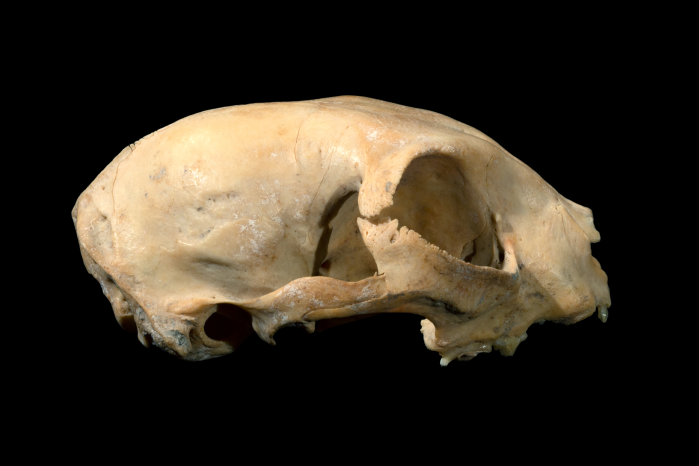

```{r setup, include = FALSE}
library(tidyverse)
library(gganimate)
library(RColorBrewer)
library(knitr)
```

<!-- adding bold and italic options -->
<style>
em {
  font-style: italic
}
strong {
  font-weight: bold;
}
</style>

## Data analysis 2

- Data visualisation
- Single categorical or ordinal variable: barcharts
- Single quantitative variable: histograms
- Data distributions
- Mean, median, and mode
- Sample variability: range and standard deviation

--- .segue .dark 

## Data visualisation

--- .class #id

## A tool for data exploration and communication

<iframe src = 'https://www.gisaid.org/' height='600px'></iframe>

--- .class #id

## A tool for data exploration and communication

<iframe src = 'https://graphics.reuters.com/world-coronavirus-tracker-and-maps/vaccination-rollout-and-access/' height='600px'></iframe>

--- .segue .dark 

## Single categorical or ordinal variable

--- .class bg:white

## Barcharts

- We can visualise a single categorical or ordinal variable using a **barchart**.
- Categories go on the **x axis** and the counts go on the **y axis**.

```{r, out.width = "60%", out.height = "60%", fig.width = 9, fig.height = 7, dpi = 600, fig.align = "center", echo = FALSE}
dat <- read.table("./data/eg_data", header = TRUE)

plot_bar1 <- ggplot(dat) +
  geom_bar(aes(x = Variable), show.legend=FALSE, colour="black", fill="coral") +
  xlab("Variable") +
  theme_bw(base_size = 25)

plot_bar1
```

--- .class #id

## Barchart example

- Human mitochondrial DNA; 4 nucleotides (A,C,G,T); 16,568 bp

```{r, echo=FALSE}
mt <- read.table("./data/human_mtDNA")
head(mt, 13)
```

--- .class bg:white

## Barchart example

- Human mitochondrial DNA; 4 nucleotides (A,C,G,T); 16,568 bp

```{r, out.width = "65%", out.height = "65%", fig.width = 9, fig.height = 7, dpi = 600, fig.align = "center", echo = FALSE}
mt <- read.table("./data/human_mtDNA_vertical", header = TRUE)

plot1 <- ggplot(mt) +
  geom_bar(aes(x = Nucleotide, fill = Nucleotide), show.legend=FALSE) +
  scale_fill_brewer(palette="Dark2") +
  theme_bw(base_size = 25)

plot1
```

--- .segue .dark 

## Single quantitative variable

--- .class bg:white

## Histograms

- We can visualise a single quantitative variable (continuous or discrete) using a histogram
- First we need to bin our data: sort into non-overlapping intervals of equal size
- The bins go on the x axis and the counts go on the y axis.

```{r, out.width = "50%", out.height = "50%", fig.width = 9, fig.height = 7, dpi = 600, fig.align = "center", echo = FALSE}
my.dat <- rnorm(100, 10, 1)
my.df <- enframe(my.dat)

plot_hist2 <- ggplot(my.df) +
  geom_histogram(aes(x = value), colour="black", fill="coral", show.legend=FALSE, bins = 6) +
  xlab("Variable (units)") +
  theme_bw(base_size = 25)

plot_hist2
```

--- &twocol bg:white

## Difference between barcharts and histograms

- Typically barcharts will have spaces between the bars
- In histograms, the bars are always touching
- Barchart x axes are categorical
- Histogram x axes are quantitative (typically have units)

*** =left

**Barchart**

```{r, out.width = "100%", out.height = "100%", fig.width = 9, fig.height = 5.5, dpi = 600, fig.align = "center", echo = FALSE}
plot_bar1
```

*** =right

**Histogram**

```{r, out.width = "100%", out.height = "100%", fig.width = 9, fig.height = 5.5, dpi = 600, fig.align = "center", echo = FALSE}
plot_hist2
```

--- &twocol

## Histogram example

*** =left

- Heights of 898 people, in metres 

```{r, echo = FALSE}
metres <- read.table("./data/heights", header=TRUE)
head(metres, 13)
```

*** =right

- Binned data

```{r, echo = FALSE, }
h <- hist(metres$height, breaks=14, plot=FALSE)
d <- data.frame(h$breaks[1:13], h$breaks[2:14], h$counts)
names(d)[1:3] <- c("start", "finish", "counts")

print(d)
```

--- .class bg:white

## Histogram example

- Using 14 bins

```{r, out.width = "60%", out.height = "60%", fig.width = 9, fig.height = 7, dpi = 600, fig.align = "center", echo = FALSE}
plot <- ggplot(metres) +
  geom_histogram(aes(x = height), colour="black", fill="lightblue", show.legend=FALSE, bins = 14) +
  theme_bw(base_size = 25)

plot
```

--- .class bg:white

## Effect of bin size

- Using 7 bins

```{r, out.width = "60%", out.height = "60%", fig.width = 9, fig.height = 7, dpi = 600, fig.align = "center", echo = FALSE}
plot <- ggplot(metres) +
  geom_histogram(aes(x = height), colour="black", fill="lightblue", show.legend=FALSE, bins = 7) +
  theme_bw(base_size = 25)

plot
```

--- .class bg:white

## Effect of bin size

- Using 28 bins

```{r, out.width = "60%", out.height = "60%", fig.width = 9, fig.height = 7, dpi = 600, fig.align = "center", echo = FALSE}
plot <- ggplot(metres) +
  geom_histogram(aes(x = height), colour="black", fill="lightblue", show.legend=FALSE, bins = 28) +
  theme_bw(base_size = 25)

plot
```

--- .segue .dark 

## Data distribution

--- &twocol bg:white

## Data distribution

- The shape of the histogram can be called a **distribution**
- Height is an example of the **normal distribution**
- It looks (more or less) like a symmetrical bell
- Very tall and very short people are rare, most people are around the middle
- Many other variables: birth weight, blood pressure, measurement error

*** =left

```{r, out.width = "50%", dpi = 300, echo = FALSE, fig.align='center'}
include_graphics("./assets/img/church-bell-152195.svg")
```

*** =right

```{r, out.width = "100%", out.height = "50%", fig.width = 9, fig.height = 5.5, dpi = 600, fig.align = "center", echo = FALSE}
my.dat <- rnorm(10000, 10, 1)
my.df <- enframe(my.dat)

plot9 <- ggplot(my.df) +
  geom_histogram(aes(x = value), colour="black", fill="coral", show.legend=FALSE, bins = 20) +
  theme_bw(base_size = 25)

plot9
```

--- .class bg:white

## Describing distributions for quantitative variables

```{r, out.width = "100%", out.height = "100%", fig.width = 12, fig.height = 7, dpi = 600, fig.align = "center", echo = FALSE}
df1 <- enframe(rnorm(10000, 10, 1))
df2 <- enframe(rnorm(10000, 15, 1))
df1$distribution <- "d1"
df2$distribution <- "d2"
two_dist <- rbind(df1, df2)

plot <- ggplot(two_dist) +
  geom_histogram(aes(x=value, fill=distribution), colour="black", show.legend=TRUE, bins = 40) +
  scale_fill_brewer(palette="Set2") +
  theme_bw(base_size = 20)

plot
```

--- .segue .dark 

## Mean, median, and mode

--- &twocol

## An average

- An average describes the central position of the distribution
- It summarises the entire distribution in a single value

*** =left

- We use three types: 
  + `mean`
  + `median`
  + `mode`

*** =right

```{r, out.width = "100%", fig.width = 9, fig.height = 7, dpi = 600, fig.align = "center", echo = FALSE}
my.dat <- rnorm(10000, 10, 1)
my.df <- enframe(my.dat)

plot <- ggplot(my.df) +
  geom_histogram(aes(x = value), colour="black", fill="coral", show.legend=FALSE, bins = 20) +
  theme_bw(base_size = 25)

plot
```

--- .class #id

## How are they calculated?

### Mean
  + Add all values together and divide by number of observations
  + Good for continuous quantitative variables, discrete variables may need rounding

### Median
  + Arrange values from smallest to largest and pick the middle one
  + Good for ordinal and quantitative continuous and discrete variables

### Mode
  + The most frequently occurring value
  + Good for ordinal and discrete quantitative variables

--- .class #id

## Quantitative discrete variable example

```console
1  2  3  3  4  4  4  5  5  5  5  6  6  6  7  7  8  9 10
```

### Mean

```console
1+2+3+3+4+4+4+5+5+5+5+6+6+6+7+7+8+9+10 = 100
100 / 19 = 5.263158
```
### Median

```console
5
```

### Mode

```console
5
```

--- &twocol bg:white

## Continuous variable example

- Height of 500 women, plotted as a histogram

*** =left

```{r, out.width = "100%", out.height = "100%", fig.width = 8, fig.height = 8, dpi = 600, fig.align = "center", echo = FALSE}
real <- enframe(rnorm(500, 1.65, 0.07))

plot <- ggplot(real) +
  geom_histogram(aes(x=value), fill="lightgrey", colour="black", show.legend=TRUE, bins = 40) +
  theme_bw(base_size = 25)+
  geom_vline(aes(xintercept = mean(value)), col="#7570B3", size=2) +
  geom_vline(aes(xintercept = median(value)), col="#D95F02", size=2) +
  labs(x="height (m)", y="count")

plot
```

*** =right

<span style="color:#7570B3; font-weight:bold">mean = `r mean(real$value)`</span>  
<span style="color:#D95F02; font-weight:bold">median = `r median(real$value)`</span>

  >- Mean and median are virtually identical
  >- A feature of the normal distribution
  >- So why do we need different measures?
  >- Not all variables are normally distributed

--- &twocol bg:white

## Ancient DNA fragment length

- DNA in ancient samples is highly fragmented
- The fragment lengths have a **skewed distribution**

*** =left

```{r, out.width = "100%", out.height = "100%", fig.width = 8, fig.height = 7, dpi = 600, fig.align = "center", echo = FALSE}
# function for calculating mode
getmode <- function(v) {
   uniqv <- unique(v)
   uniqv[which.max(tabulate(match(v, uniqv)))]
}

adna <- read.table("./data/HV74-Dab-SS_S12_dataset1_rld.txt", header=TRUE)

plot <- ggplot(adna) +
  geom_histogram(aes(x=bp), fill="lightgrey", colour="black", show.legend=TRUE, bins = 30) +
  theme_bw(base_size = 25)+
  geom_vline(aes(xintercept = mean(bp)), col="#7570B3", size=2) +
  geom_vline(aes(xintercept = median(bp)), col="#D95F02", size=2) +
  geom_vline(aes(xintercept = getmode(bp)), col="#E7298A", size=2) +
  labs(x="DNA fragment length (bp)", y="count")

plot
```
*** =right

```{r, out.width = "75%", dpi = 300, , echo = FALSE}

```

800 year old cat (Carl Vivian, Uni Leicester)

<span style="color:#7570B3; font-weight:bold">mean = `r mean(adna$bp)`</span>  
<span style="color:#D95F02; font-weight:bold">median = `r median(adna$bp)`</span>  
<span style="color:#E7298A; font-weight:bold">mode = `r getmode(adna$bp)`</span>

--- .segue .dark 

## Sample variability

--- .class bg:white

## An average doesn't give the whole picture

```{r, out.width = "95%", out.height = "95%", fig.width = 12, fig.height = 7, dpi = 600, fig.align = "center", echo = FALSE}
df1 <- enframe(rnorm(10000, 10, 1))
df2 <- enframe(rnorm(10000, 10, 4))
df1$distribution <- "d1"
df2$distribution <- "d2"
two_dist <- rbind(df1, df2)

plot <- ggplot(two_dist) +
  geom_histogram(aes(x=value, fill=distribution), alpha = 0.75, position="identity", show.legend=TRUE, bins = 40) +
  scale_fill_brewer(palette="Set2") +
  geom_vline(aes(xintercept = mean(df1$value)), col="black", size=1) +
  theme_bw(base_size = 20)

plot
```

--- .class #id

## Sample variability

- **Variability** describes how narrow or spread out the distribution is
- Also called **dispersion**, **scatter** or **spread**
- We will look at two ways of measuring variability:

### Range

- The maximum minus the minimum values

### Standard deviation

- More complex
- Positive number in same units as the data
- Bigger numbers indicate higher variability

--- .class bg:white

## Range

```{r, out.width = "95%", out.height = "95%", fig.width = 16, fig.height = 7, dpi = 600, fig.align = "center", echo = FALSE}
dfmy <- read.csv("./data/1000_norm_samp.csv", header=TRUE)
rangmy <- range(dfmy$value)

plot <- ggplot(dfmy) +
  geom_histogram(aes(x=value), fill = "#E6AB02", show.legend=FALSE, bins = 40) +
  geom_vline(aes(xintercept = mean(value)), col="black", size=1) +
  geom_vline(aes(xintercept = rangmy[1]), col="#7570B3", size=2) +
  geom_vline(aes(xintercept = rangmy[2]), col="#7570B3", size=2) +
  theme_bw(base_size = 30)

plot
```

- **Mean = `r mean(dfmy$value)`**
- <span style="color:#7570B3; font-weight:bold">Range = `r rangmy[2]` - `r rangmy[1]` = `r rangmy[2] - rangmy[1]`</span> 

--- .class #id

## Standard deviation

- Complex mathematical formula, the value is easy to understand
- In research science, we would just use a computer to calculate!
- square root (sum of squared differences from mean, divided by sample size minus 1)

Human|Height|Mean|Difference|Squared
-----|------|----|----------|-------
1|160|165.33|-5.33|28.44
2|166|165.33|0.67|0.44
3|168|165.33|2.67|7.11
4|161|165.33|-4.33|18.78
5|167|165.33|1.67|2.78
6|170|165.33|4.67|21.78
||||TOTAL|79.33

- SD = square root (sum of squares / 6 - 1) = square root (79.33/5) = **3.98**

--- .class #id

## Or just use a computer

```{r, echo=TRUE}
heights <- c(160, 166, 168, 161, 167, 170)
mean(heights)
sd(heights)
```
### Now isn't that easier :)

--- .class bg:white

## Standard deviation and the normal distribution

```{r, out.width = "95%", out.height = "95%", fig.width = 16, fig.height = 7, dpi = 600, fig.align = "center", echo = FALSE}
dfmy <- read.csv("./data/1000_norm_samp.csv", header=TRUE)

plotsd <- ggplot(dfmy) +
  geom_histogram(aes(x=value), fill = "#E6AB02", show.legend=FALSE, bins = 40) +
  geom_vline(aes(xintercept = mean(value)), col="black", size=1) +
  geom_vline(aes(xintercept = mean(value) + sd(value)), col="#E7298A", size=2) +
  geom_vline(aes(xintercept = mean(value) - sd(value)), col="#E7298A", size=2) +
  geom_vline(aes(xintercept = mean(value) + (sd(value)*2)), col="#E7298A", size=2) +
  geom_vline(aes(xintercept = mean(value) - (sd(value)*2)), col="#E7298A", size=2) +
  theme_bw(base_size = 30)

plotsd +
  annotate(geom = "label", x=16.5, y=775, label="+ 1 SD", size=8, fontface="bold") +
  annotate(geom = "label", x=13.5, y=775, label="- 1 SD", size=8, fontface="bold") +
  annotate(geom = "label", x=19.5, y=775, label="+ 2 SD", size=8, fontface="bold") +
  annotate(geom = "label", x=10.5, y=775, label="- 2 SD", size=8, fontface="bold")
```

- **Mean = `r mean(dfmy$value)`**, <span style="color:#E7298A; font-weight:bold">Standard deviation = `r sd(dfmy$value)`</span> 

--- .class bg:white

## Standard deviation and the normal distribution

```{r, out.width = "95%", out.height = "95%", fig.width = 16, fig.height = 7, dpi = 600, fig.align = "center", echo = FALSE}
dfmy <- read.csv("./data/1000_norm_samp.csv", header=TRUE)

plotsd <- ggplot(dfmy) +
  geom_histogram(aes(x=value), fill = "#E6AB02", show.legend=FALSE, bins = 40) +
  geom_vline(aes(xintercept = mean(value)), col="black", size=1) +
  geom_vline(aes(xintercept = mean(value) + sd(value)), col="#E7298A", size=2) +
  geom_vline(aes(xintercept = mean(value) - sd(value)), col="#E7298A", size=2) +
  geom_vline(aes(xintercept = mean(value) + (sd(value)*2)), col="#E7298A", size=2) +
  geom_vline(aes(xintercept = mean(value) - (sd(value)*2)), col="#E7298A", size=2) +
  theme_bw(base_size = 30)

plotsd +
  geom_segment(aes(x = mean(value) + sd(value), y = 500, xend = mean(value) - sd(value), 
                   yend = 500), arrow = arrow(ends="both"), size=1, colour="black") +
  annotate(geom = "label", x=15, y=425, label="68% of observations", size=8, fontface="bold") +
  geom_segment(aes(x = mean(value) + (sd(value)*2), y = 300, xend = mean(value) - (sd(value)*2),
                   yend = 300), arrow = arrow(ends="both"), size=1, colour="black") +
    annotate(geom = "label", x=15, y=225, label="95% of observations", size=8, fontface="bold")
```

- **Mean = `r mean(dfmy$value)`**, <span style="color:#E7298A; font-weight:bold">Standard deviation = `r sd(dfmy$value)`</span> 
- 68% of observations fall within 1 SD of the mean, 95% with 2 SDs, and 99.7% within 3 SDs

--- .class #id

## Data analysis 2

- Data visualisation
- Single categorical or ordinal variable: barcharts
- Single quantitative variable: histograms
- Data distributions
- Mean, median, and mode
- Sample variability: range and standard deviatio

--- &thankyou

## Next time

**Analysis of two variables, and hypothesis testing**


