<!-- adding bold and italic options -->
<style>
em {
  font-style: italic
}
strong {
  font-weight: bold;
}
</style>

## Data analysis 2

- Data visualisation
- Single categorical or ordinal variable: barcharts
- Single quantitative variable: histograms
- Data distributions
- Mean, median, and mode
- Sample variability: range and standard deviation

--- .segue .dark 

## Data visualisation

--- .class #id

## A tool for data exploration and communication

<iframe src = 'https://www.gisaid.org/' height='600px'></iframe>

--- .class #id

## A tool for data exploration and communication

<iframe src = 'https://graphics.reuters.com/world-coronavirus-tracker-and-maps/vaccination-rollout-and-access/' height='600px'></iframe>

--- .segue .dark 

## Single categorical or ordinal variable

--- .class bg:white

## Barcharts

- We can visualise a single categorical or ordinal variable using a **barchart**.
- Categories go on the **x axis** and the counts go on the **y axis**.

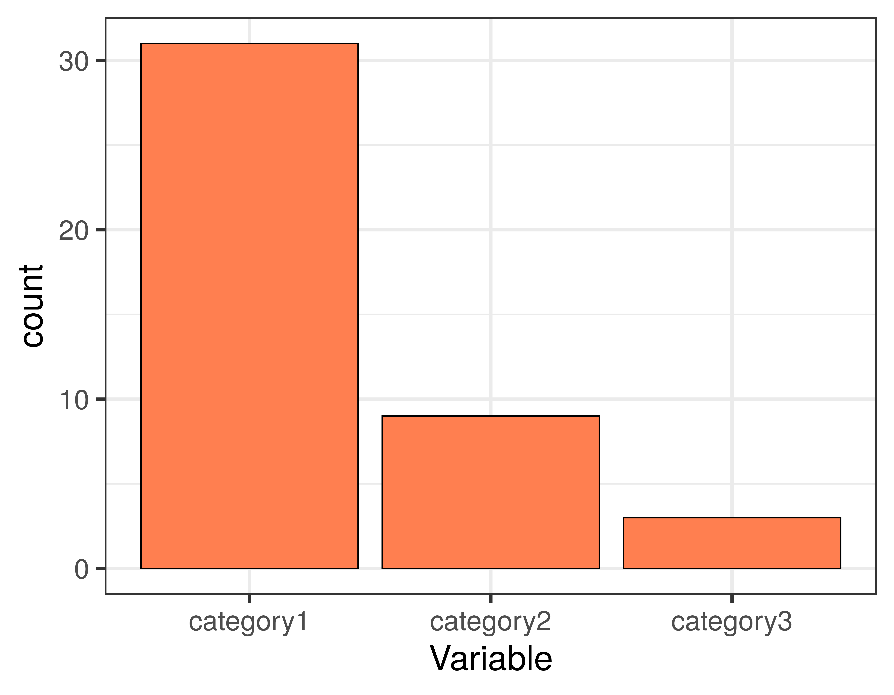

--- .class #id

## Barchart example

- Human mitochondrial DNA; 4 nucleotides (A,C,G,T); 16,568 bp


```
##                                                                                    V1
## 1  GATCACAGGTCTATCACCCTATTAACCACTCACGGGAGCTCTCCATGCATTTGGTATTTTCGTCTGGGGGGTGTGCACGCGA
## 2  TAGCATTGCGAGACGCTGGAGCCGGAGCACCCTATGTCGCAGTATCTGTCTTTGATTCCTGCCCCATCCCATTATTTATCGC
## 3  ACCTACGTTCAATATTACAGGCGAACATACTTACTAAAGTGTGTTAATTAATTAATGCTTGTAGGACATAATAATAACAATT
## 4  GAATGTCTGCACAGCCGCTTTCCACACAGACATCATAACAAAAAATTTCCACCAAACCCCCCCTCCCCCGCTTCTGGCCACA
## 5  GCACTTAAACACATCTCTGCCAAACCCCAAAAACAAAGAACCCTAACACCAGCCTAACCAGATTTCAAATTTTATCTTTTGG
## 6  CGGTATGCACTTTTAACAGTCACCCCCCAACTAACACATTATTTTCCCCTCCCACTCCCATACTACTAATCTCATCAATACA
## 7  ACCCCCGCCCATCCTACCCAGCACACACACACCGCTGCTAACCCCATACCCCGAACCAACCAAACCCCAAAGACACCCCCCA
## 8  CAGTTTATGTAGCTTACCTCCTCAAAGCAATACACTGAAAATGTTTAGACGGGCTCACATCACCCCATAAACAAATAGGTTT
## 9  GGTCCTAGCCTTTCTATTAGCTCTTAGTAAGATTACACATGCAAGCATCCCCGTTCCAGTGAGTTCACCCTCTAAATCACCA
## 10 CGATCAAAAGGGACAAGCATCAAGCACGCAGCAATGCAGCTCAAAACGCTTAGCCTAGCCACACCCCCACGGGAAACAGCAG
## 11 TGATTAACCTTTAGCAATAAACGAAAGTTTAACTAAGCTATACTAACCCCAGGGTTGGTCAATTTCGTGCCAGCCACCGCGG
## 12 TCACACGATTAACCCAAGTCAATAGAAGCCGGCGTAAAGAGTGTTTTAGATCACCCCCTCCCCAATAAAGCTAAAACTCACC
## 13 TGAGTTGTAAAAAACTCCAGTTGACACAAAATAGACTACGAAAGTGGCTTTAACATATCTGAACACACAATAGCTAAGACCC
```

--- .class bg:white

## Barchart example

- Human mitochondrial DNA; 4 nucleotides (A,C,G,T); 16,568 bp

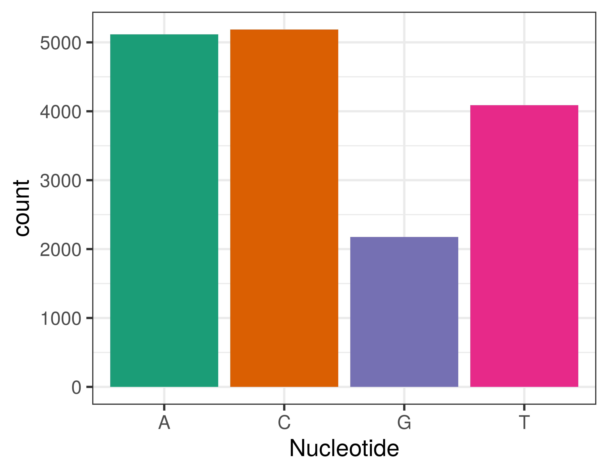

--- .segue .dark 

## Single quantitative variable

--- .class bg:white

## Histograms

- We can visualise a single quantitative variable (continuous or discrete) using a histogram
- First we need to bin our data: sort into non-overlapping intervals of equal size
- The bins go on the x axis and the counts go on the y axis.

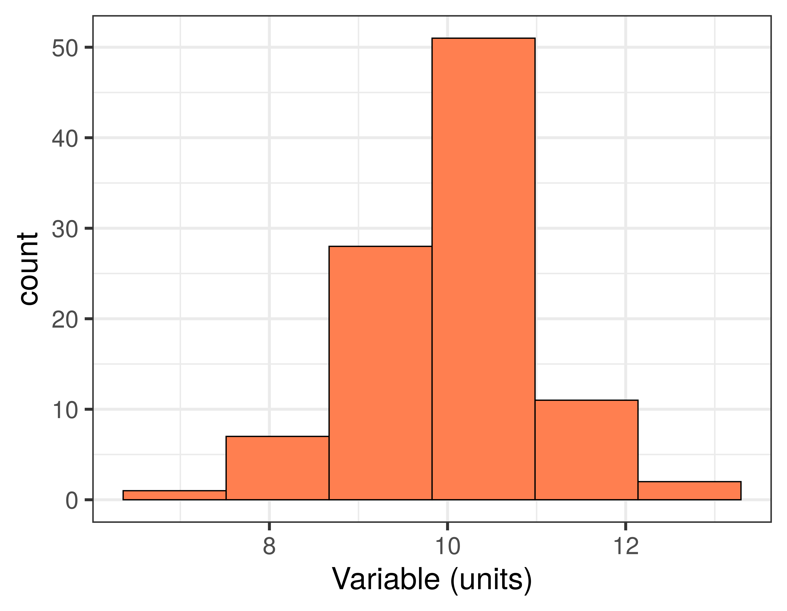

--- &twocol bg:white

## Difference between barcharts and histograms

- Typically barcharts will have spaces between the bars
- In histograms, the bars are always touching
- Barchart x axes are categorical
- Histogram x axes are quantitative (typically have units)

*** =left

**Barchart**

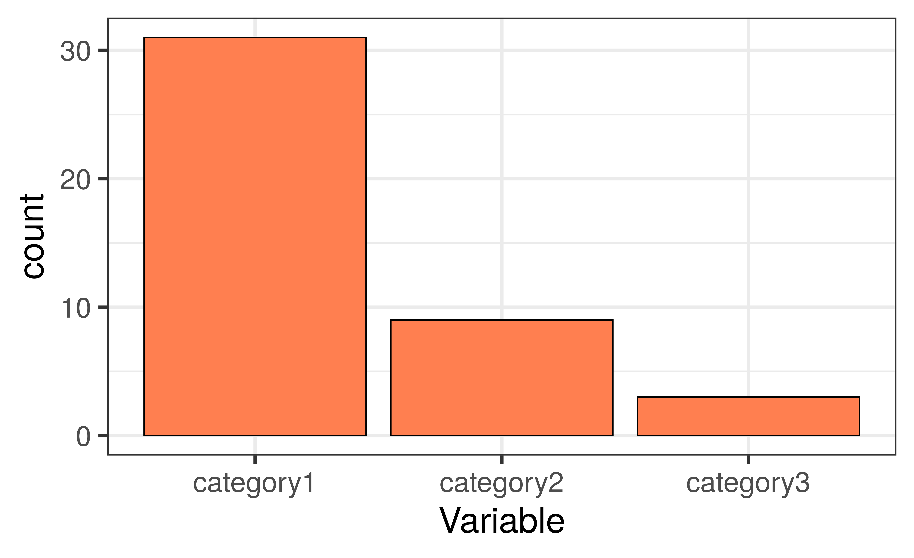

*** =right

**Histogram**

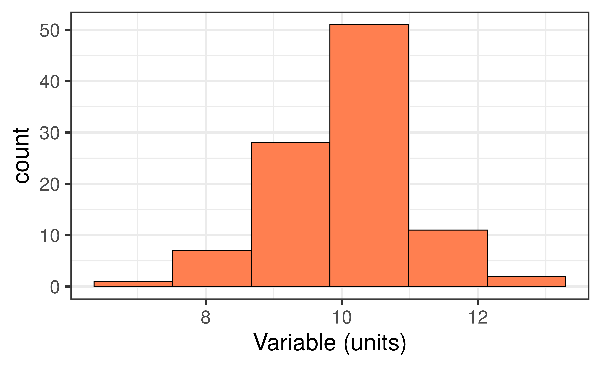

--- &twocol

## Histogram example

*** =left

- Heights of 898 people, in metres 


```
##    height
## 1    1.86
## 2    1.76
## 3    1.75
## 4    1.75
## 5    1.87
## 6    1.84
## 7    1.66
## 8    1.66
## 9    1.80
## 10   1.73
## 11   1.79
## 12   1.74
## 13   1.70
```

*** =right

- Binned data


```
##    start finish counts
## 1   1.40   1.45      3
## 2   1.45   1.50      3
## 3   1.50   1.55     44
## 4   1.55   1.60    122
## 5   1.60   1.65    163
## 6   1.65   1.70    171
## 7   1.70   1.75    149
## 8   1.75   1.80    146
## 9   1.80   1.85     76
## 10  1.85   1.90     13
## 11  1.90   1.95      6
## 12  1.95   2.00      1
## 13  2.00   2.05      1
```

--- .class bg:white

## Histogram example

- Using 14 bins

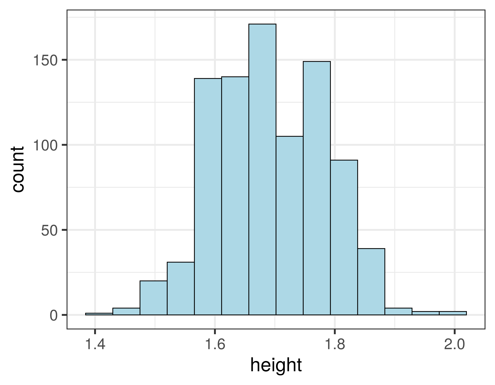

--- .class bg:white

## Effect of bin size

- Using 7 bins

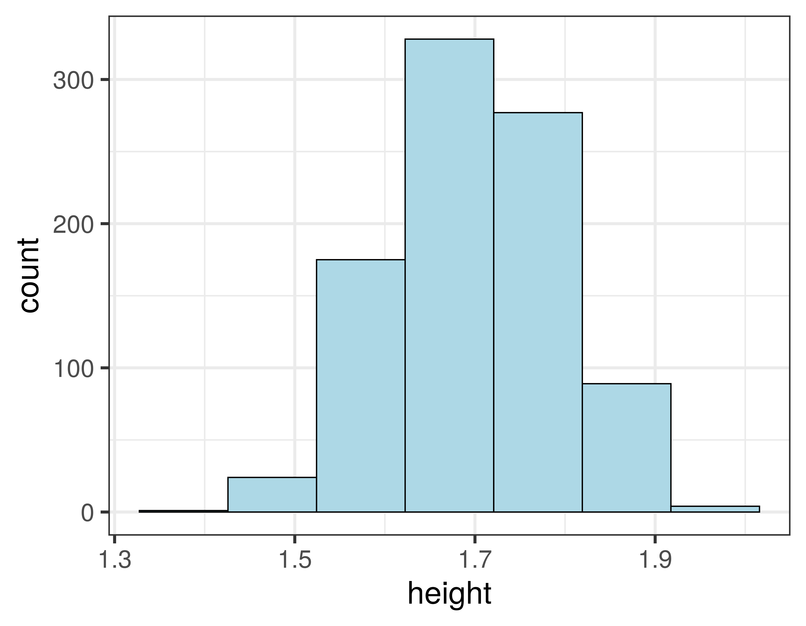

--- .class bg:white

## Effect of bin size

- Using 28 bins

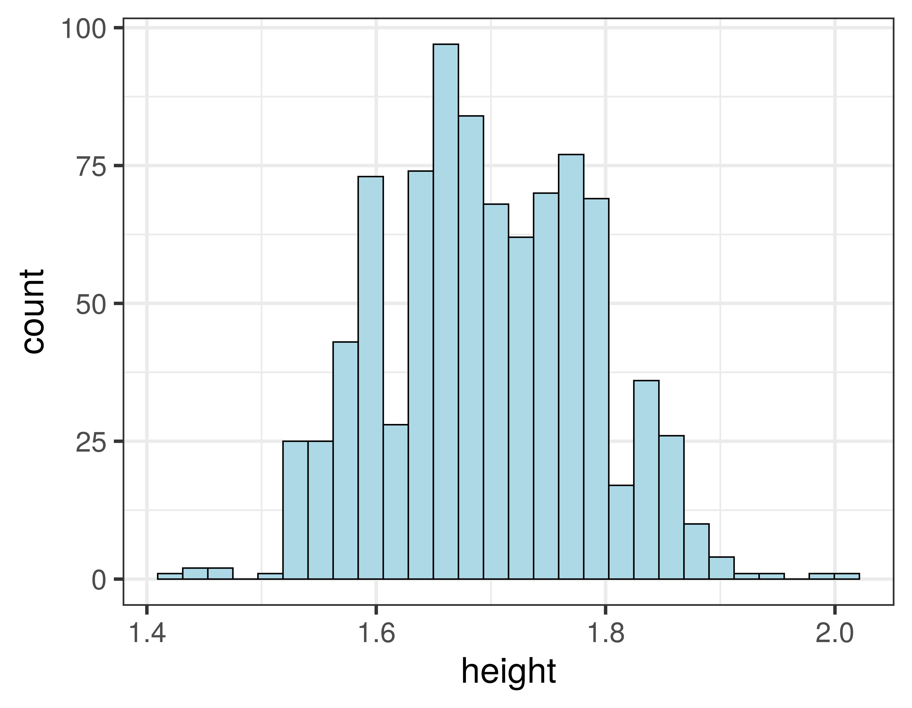

--- .segue .dark 

## Data distribution

--- &twocol bg:white

## Data distribution

- The shape of the histogram can be called a **distribution**
- Height is an example of the **normal distribution**
- It looks (more or less) like a symmetrical bell
- Very tall and very short people are rare, most people are around the middle
- Many other variables: birth weight, blood pressure, measurement error

*** =left


*** =right

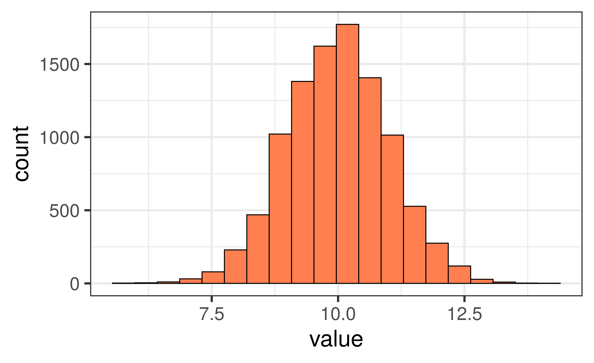

--- .class bg:white

## Describing distributions for quantitative variables

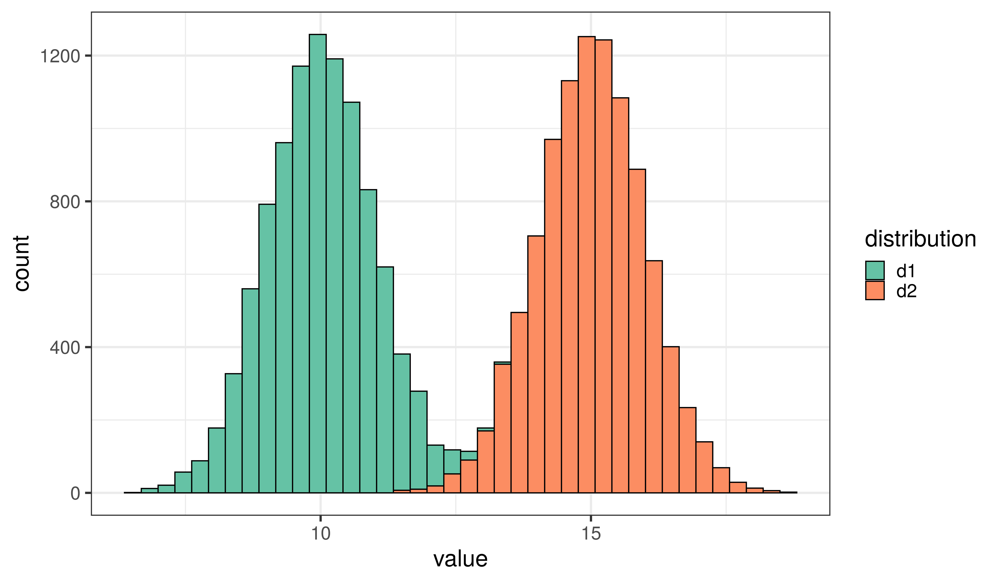

--- .segue .dark 

## Mean, median, and mode

--- &twocol

## An average

- An average describes the central position of the distribution
- It summarises the entire distribution in a single value

*** =left

- We use three types: 
  + `mean`
  + `median`
  + `mode`

*** =right

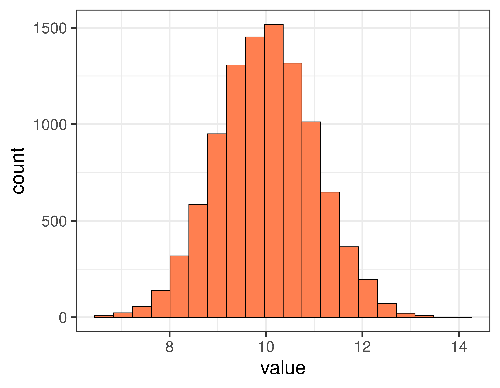

--- .class #id

## How are they calculated?

### Mean
  + Add all values together and divide by number of observations
  + Good for continuous quantitative variables, discrete variables may need rounding

### Median
  + Arrange values from smallest to largest and pick the middle one
  + Good for ordinal and quantitative continuous and discrete variables

### Mode
  + The most frequently occurring value
  + Good for ordinal and discrete quantitative variables

--- .class #id

## Quantitative discrete variable example

```console
1  2  3  3  4  4  4  5  5  5  5  6  6  6  7  7  8  9 10
```

### Mean

```console
1+2+3+3+4+4+4+5+5+5+5+6+6+6+7+7+8+9+10 = 100
100 / 19 = 5.263158
```
### Median

```console
5
```

### Mode

```console
5
```

--- &twocol bg:white

## Continuous variable example

- Height of 500 women, plotted as a histogram

*** =left

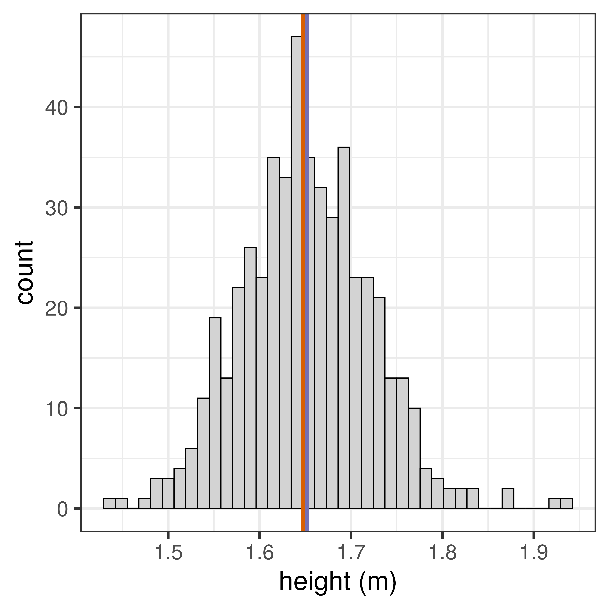

*** =right

<span style="color:#7570B3; font-weight:bold">mean = 1.651378</span>  
<span style="color:#D95F02; font-weight:bold">median = 1.6475637</span>

  >- Mean and median are virtually identical
  >- A feature of the normal distribution
  >- So why do we need different measures?
  >- Not all variables are normally distributed

--- &twocol bg:white

## Ancient DNA fragment length

- DNA in ancient samples is highly fragmented
- The fragment lengths have a **skewed distribution**

*** =left

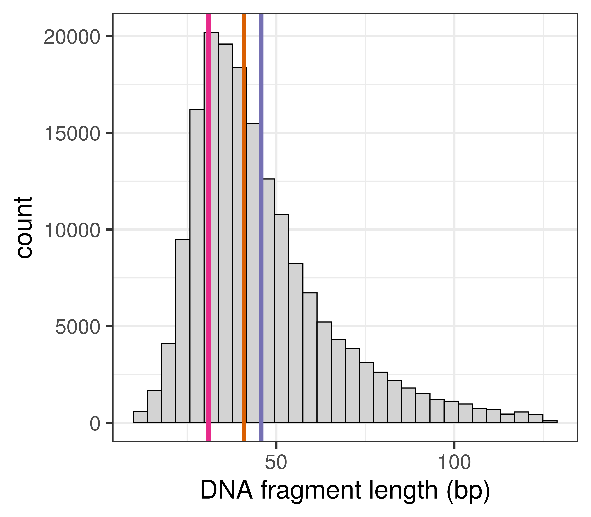
*** =right

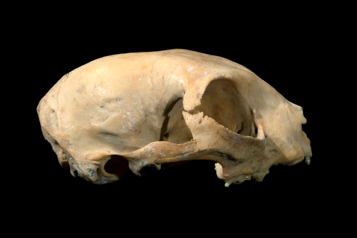

800 year old cat (Carl Vivian, Uni Leicester)

<span style="color:#7570B3; font-weight:bold">mean = 45.8054171</span>  
<span style="color:#D95F02; font-weight:bold">median = 41</span>  
<span style="color:#E7298A; font-weight:bold">mode = 31</span>

--- .segue .dark 

## Sample variability

--- .class bg:white

## An average doesn't give the whole picture

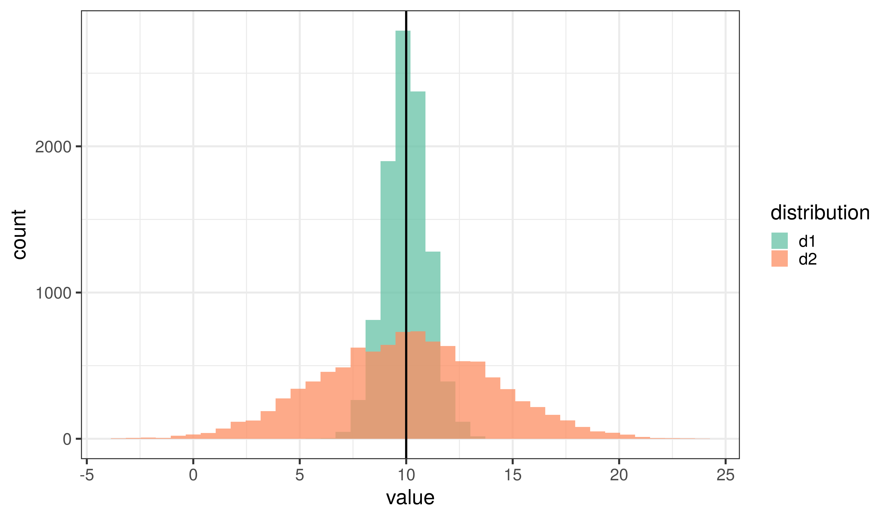

--- .class #id

## Sample variability

- **Variability** describes how narrow or spread out the distribution is
- Also called **dispersion**, **scatter** or **spread**
- We will look at two ways of measuring variability:

### Range

- The maximum minus the minimum values

### Standard deviation

- More complex
- Positive number in same units as the data
- Bigger numbers indicate higher variability

--- .class bg:white

## Range

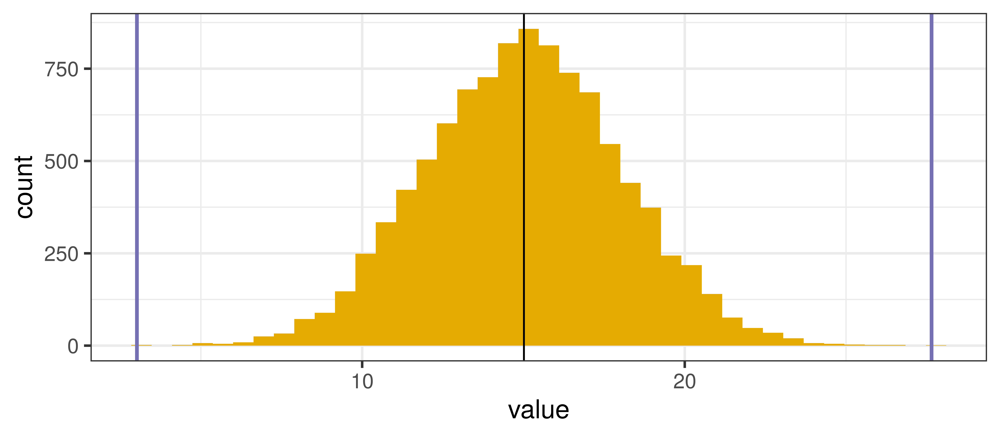

- **Mean = 15.0149312**
- <span style="color:#7570B3; font-weight:bold">Range = 27.6507856 - 3.017839 = 24.6329467</span> 

--- .class #id

## Standard deviation

- Complex mathematical formula, the value is easy to understand
- In research science, we would just use a computer to calculate!
- square root (sum of squared differences from mean, divided by sample size minus 1)

Human|Height|Mean|Difference|Squared
-----|------|----|----------|-------
1|160|165.33|-5.33|28.44
2|166|165.33|0.67|0.44
3|168|165.33|2.67|7.11
4|161|165.33|-4.33|18.78
5|167|165.33|1.67|2.78
6|170|165.33|4.67|21.78
||||TOTAL|79.33

- SD = square root (sum of squares / 6 - 1) = square root (79.33/5) = **3.98**

--- .class #id

## Or just use a computer


```r
heights <- c(160, 166, 168, 161, 167, 170)
mean(heights)
```

```
## [1] 165.3333
```

```r
sd(heights)
```

```
## [1] 3.983298
```
### Now isn't that easier :)

--- .class bg:white

## Standard deviation and the normal distribution

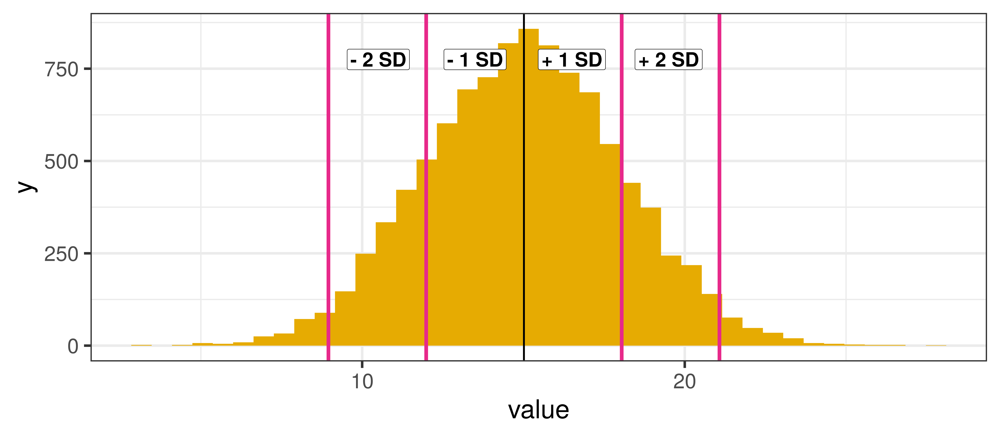

- **Mean = 15.0149312**, <span style="color:#E7298A; font-weight:bold">Standard deviation = 3.0303673</span> 

--- .class bg:white

## Standard deviation and the normal distribution

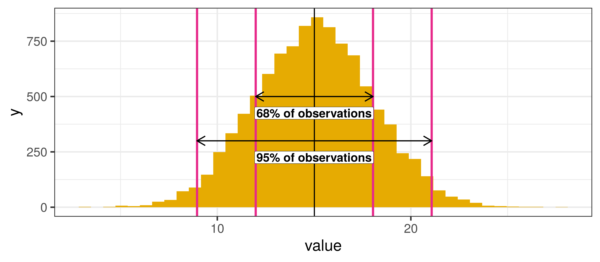

- **Mean = 15.0149312**, <span style="color:#E7298A; font-weight:bold">Standard deviation = 3.0303673</span> 
- 68% of observations fall within 1 SD of the mean, 95% with 2 SDs, and 99.7% within 3 SDs

--- .class #id

## Data analysis 2

- Data visualisation
- Single categorical or ordinal variable: barcharts
- Single quantitative variable: histograms
- Data distributions
- Mean, median, and mode
- Sample variability: range and standard deviatio

--- &thankyou

## Next time

**Analysis of two variables, and hypothesis testing**


